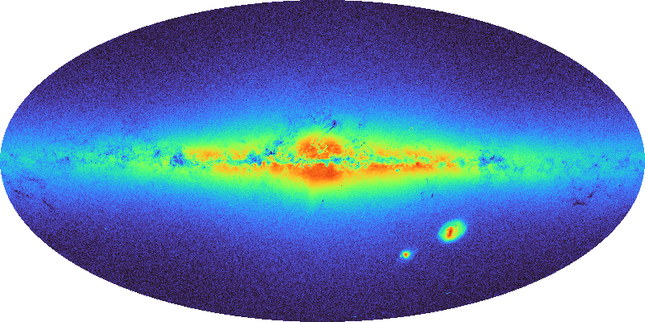

# `hpx-cli`

Perform HEALPix related operations from the command line.

## About

This **C**ommand **Line** **I**nterface (CLI) is made from the
[CDS HEALPix Rust library](https://github.com/cds-astro/cds-healpix-rust).
It allows to perform HEALPix related operations like:
adding a column of HEALPix indices computed from positions to a CSV file;
indexing and querying a CVS file by HEALpix indices;
build density maps; get the vertices of given HEALpix cells;
and more.

For a complementaty tool manipulating MOCs,
see [moc-cli](https://github.com/cds-astro/cds-moc-rust/tree/main/crates/cli).

## Install

### Compile from source code

[Install rust](https://www.rust-lang.org/tools/install)
(and check that `~/.cargo/bin/` is in your path),
or update the Rust compiler with:

```bash
rustup update
``` 

Clone the [cdshealpix rust lib](https://github.com/cds-astro/cds-healpix-rust) project:

```bash
git clone https://github.com/cds-astro/cds-healpix-rust
```

Install from using `cargo`:

```bash
cargo install --path crates/cli
```

(due to a heavy use of [monomorphization](https://en.wikipedia.org/wiki/Monomorphization),
the compilation time may be long).

## Command line help (excerpt)

```bash
> hpx --help
Command-line tool to play with HEALPix

Usage: hpx <COMMAND>

Commands:
  proj    Computes the projected coordinates (x, y) ∊ ([0..8[, [-2..2]) of input equatorial coordinates
  unproj  Computes the equatorial coordinates of Healpix projected coordinates (x, y) ∊ ([0..8[, [-2..2])
  nested  Operations in the HEALPix NESTED scheme
  sort    Sorts a CSV file by order 29 HEALPix NESTED indices, uses external sort to support huge files
  hcidx   Create an index on an HEALPix NESTED sorted CSV file to then quickly retrieve rows in a given HEALPix cell
  qhcidx  Query an HEALPix sorted and indexed CSV file (see the 'hcidx' command)
  map     Create and manipulate HEALPix count and density maps
  mom     Create and manipulate HEALPix count and density maps
  cov     Compute the list of NESTED Healpix cells in a given sky region (see also moc-cli)
  help    Print this message or the help of the given subcommand(s)

Options:
  -h, --help     Print help
  -V, --version  Print version
```

```bash
> hpx nested --help
Operations in the HEALPix NESTED scheme

Usage: hpx nested <COMMAND>

Commands:
  table       Prints the table of Healpix layers properties (depth, nside, ncells, ...)
  bestdepth   For a cone of given radius, returns the largest depth at which the cone covers max 9 cells
  hash        Get the Healpix hash value (aka ipix or cell number) of given equatorial position(s)
  bilinear    Get the bilinear interpolation parameters, 4x(hash, weight), of given equatorial position(s)
  center      Get the longitude and latitude (in degrees) of the center of the cell of given hash value
  vertices    Get the longitude and latitude (in degrees) of the 4 vertices (S, W, N, E) of the cell of given hash value
  neighbours  Get the hash value (aka ipix or cell number) of the neighbours of the cell of given hash value (S, SE, E, SW, NE, W, NW, N)
  touniq      Transform regular hash values (aka ipix or cell numbers) into the UNIQ representation
  toring      Transform regular hash values (aka ipix or cell numbers) from the NESTED to the RING scheme
  help        Print this message or the help of the given subcommand(s)

Options:
  -h, --help  Print help

```

```bash
> hpx cov --help
Compute the list of NESTED Healpix cells in a given sky region (see also moc-cli)

Usage: hpx cov [OPTIONS] <DEPTH> <COMMAND>

Commands:
  cone      Cone coverage
  ellipse   Elliptical cone coverage
  ring      Ring coverage
  zone      Zone coverage
  box       Box coverage
  polygon   Polygon coverage
  stcs      STC-S region coverage
  stcsfile  STC-S region provided in a file coverage
  help      Print this message or the help of the given subcommand(s)

Arguments:
  <DEPTH>
          Maximum depth (aka order) of the Healpix cells in the coverage

Options:
  -t, --out-type <OUTPUT_TYPE>
          Output type
          
          [default: csv]

          Possible values:
          - csv:      CSV serialization
          - fits:     FITS serialization
          - bintable: FITS BINTABLE serialization

  -o, --output-file <FILE>
          Write in the given output file instead of stdout (mandatory for FITS)

  -h, --help
          Print help (see a summary with '-h')

```

Tip: you can use `--help` inside sub-commands, sub-sub-commands, ... to get contextual help!

## Examples

You may find a quite extensive set of examples it
the test script [cli_test.bash](esource/cli_test.bash).

But here a few additional examples.

### Compute a density map and a density MOM a 1.4 billion sources

The file `gaia_edr3_dist.csv` is a 165 GB file containing 1\,467\,744\,819 rows and 10 columns:

```bash
> head -2 gaia_edr3_dist.csv
source_id,RA_ICRS,DE_ICRS,r_med_geo,r_lo_geo,r_hi_geo,r_med_photogeo,r_lo_photogeo,r_hi_photogeo,flag
1000000057322000000,104.87975539563,55.95486459306,784.559143,476.918579,1348.18896,2343.54736,1892.65027,2683.65625,20033
1000000121746472704,104.85627575018,55.96825004364,1875.9657,1396.88684,2913.11401,1552.66638,1330.32129,1744.04968,10033
1000000156106220032,104.86295428908,55.97882280840,2708.93115,1986.14282,4164.81152,1827.14001,1626.5304,1988.9436,10033
1000000156106221440,104.85273193584,55.98099099003,1336.84521,1198.19202,1502.92432,1203.64136,1117.92993,1306.02368,10033
...
```

We want to build and view the density map of the file, at an HEALPix depth = 11.
First build the density map.

```bash
> time hpx map dens 11 gaia_edr3_dist.dens.fits csv -d , -l 2 -b 3 --header --chunk-size 100000000 --parallel 32 gaia_edr3_dist.csv

real	15m27,858s
user	27m20,545s
sys	34m42,810s
```

Or, a better option (faster while single-threaded):

```bash
> time cut -f , -d 2,3 gaia_edr3_dist.csv | tail -n +2 \
  | hpx map dens 11 gaia_edr3_dist.dens.fits list -d ,

real	8m25,812s
user	11m7,242s
sys	3m40,669s
```

The outut file size is 385 MB (quite large!): 50331648 cells containing a double precision
float do lead to $\frac{50331648 \times 8}{1024^2} = 384\,\mathrm{MB}$.  
We can transform it into a 400x800 pixels PNG file to visualize it:

```bash
> time hpx map view --silent gaia_edr3_dist.dens.fits gaia_edr3_dist.dens.png allsky 400

real	0m20,361s
user	0m19,246s
sys	0m0,492s
```

Here the result:


Both to reduce its size, and to remove the white noise, we can make a `Chi2 MOM`, i.e.
a multi-resolution map obtained by merging sibling pixels having densities possibly comming from a same common density
according to a chi-square criteria (the conversion is quite fast, 1s):

```bash
> time hpx map convert gaia_edr3_dist.dens.fits gaia_edr3_dist.dens.mom.fits dens2chi2mom

real	0m0,978s
user	0m0,661s
sys	0m0,317s
```

The result file is only 13 MB large (a **x30 compression factor, while removing noise**!).
We can also convert this MOM into a image:

```bash
time hpx mom view --silent gaia_edr3_dist.dens.mom.fits gaia_edr3_dist.dens.mom.png allsky 400

real	0m0,494s
user	0m0,478s
sys	0m0,013s
```

And here the result (much faster to compute, only 0.5s):


Now let's zoom and the LMC (position 080.8942 -69.7561 in ICRS and 280.4652 -32.8884 in galactic):

Both in the density map

```bash
> time hpx map view --silent gaia_edr3_dist.dens.fits gaia_edr3_dist.dens.lmc.png custom -l 280.4652 -b -32.8884 sin 400 400 --x-bounds [-0.15..0.15] --y-bounds [-0.15..0.15]

real	0m7,507s
user	0m7,277s
sys	0m0,229s
```

and in the density MOM:

```bash
> time hpx mom view --silent gaia_edr3_dist.dens.mom.fits gaia_edr3_dist.dens.mom.lmc.png custom -l 280.4652 -b -32.8884 sin 400 400 --x-bounds [-0.15..0.15] --y-bounds [-0.15..0.15]

real	0m0,237s
user	0m0,227s
sys	0m0,010s
```


### Indexation of a large CSV file

Like in the previous example, we are working with 165 GB large file `gaia_edr3_dist.csv`
(1\,467\,744\,819 rows, 10 columns).

We can first sort this file according the order 29 HEALPix index:

```bash
time hpx sort --header -d , -o gaia_edr3_dist.sorted.csv -l 2 -b 3 gaia_edr3_dist.csv

real  89m5,997s
user  184m9.269s
sys 23m21,342s
```

Then, we index the sorted file at an HEALPix level equals to 9:

```bash
time hpx hcidx --header -d , --depth 9 -o gaia_edr3_dist.sorted.hci.fits -l 2 -b 3 gaia_edr3_dist.sorted.csv

real	6m39,257s
user	4m51,979s
sys	1m30,032s
```

the size of the resulting index file `gaia_edr3_dist.sorted.hci.fits` is 25 MB, to index cells of size about 7 arcmin by
7 arcmin.

TODO: here we miss the possibility to create an implicit density map covering only the cells in the BMOC.

## To-do list

* [ ] Add more methods to merge Skymaps
* [ ] Add more methods to merge MOMs
* [ ] Add `path_along_cell_edge` method?
* [ ] ...

## Disclaimer

Such a tool is developed by a single person, in charge of other duties, with a limited amount of time.  
It is probably not as bulletproof as I would like: in case of bug, please open an issue.  
Also, the CLI serve mainly two purposes: my own usage, and be a demonstrator to quickly test functionalities.  
It means that no much thought has been given to make it user friendly (it could change if people show an interest, help
welcome to improve this).

## License

Like most projects in Rust, this project is licensed under either of

* Apache License, Version 2.0, ([LICENSE-APACHE](LICENSE-APACHE) or
  http://www.apache.org/licenses/LICENSE-2.0)
* MIT license ([LICENSE-MIT](LICENSE-MIT) or
  http://opensource.org/licenses/MIT)

at your option.

## Contribution

Unless you explicitly state otherwise, any contribution intentionally submitted
for inclusion in this project by you, as defined in the Apache-2.0 license,
shall be dual licensed as above, without any additional terms or conditions.

